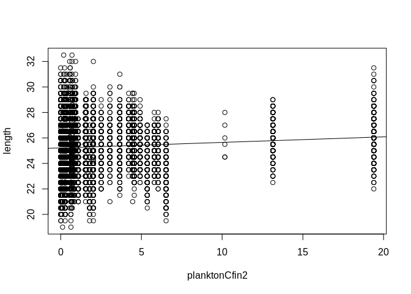

# Summary

During performing the analysis struggled with two issues:
- missing the information about the year complicates performing analysis, especially based on the time windows.
- *carret* pacckage didn't install in the terminate period of time.
- *ggplotly* package were unavailible in my RStudio version.

Enclosed the code to perform the posible *caret* operations. Made a regression graphs for each variable, but it doesn't make sense - the only conclusion from analysis is: 'Let's cool the water to keep herrings long and fit!'.


# Dataset

## General information

We operate on dataset combining the observations about the herring fishing in the european part of the Atlantic ocean. It contains of **52582 observations** devided into **15 variables**, gathered from the last 60 years (let's imagine the amount of the unnecessary, bureaucratic work made by the fishermans). The data was collected from the by chance herring sample from the commercial fishing around all the european part of the Atlantic ocean.

## Cleaning the data

Performed operations:  
* **renaming columns** to ensure better data understanding.  
* **imputations** were performed to improve data quality. Removing some variables with missing data is rather a wird option, because percent of NAs in dataset is rather insignificant (~3% on average, differs among the variables).  
* **removing highly correlated variables**. Two variables, *length* and *monthNr*, were excluded from reduction operation, due to being independent and factor, respectively. Removed variable:  
- correlated to *herrinsNumber*: *fryLeftAnnualPrc* (-0.71), *fryLeftPrc* (-0.51), *fryAnnualSize* (0.37)  
- correlated to *planktonChel1*: *planktonLcop1* (0.93), *northAtlanticOscillation* (-0.5)
- correlated to *planktonChel2*:  *planktonLcop2* (0.86)  
- *planktonCfun1* due to inproper density (lack of the diversity).

<!-- -->

## Statistics
Bellow the cleaned dataset summary (a descriptive statistics) is presented. See both graphic descriptive statistics and quantitative descriptive statistics.

### Graphic descriptive statistics 

<!-- -->

### Quantitative descriptive statistics 


```
## 
##  1536 values imputed to 2.024818 
## 
## 
##  1555 values imputed to 10.00566 
## 
## 
##  1556 values imputed to 21.22108 
## 
## 
##  1584 values imputed to 13.87466
```

```
##      length     planktonCfin2     planktonChel1    planktonChel2   
##  Min.   :19.0   Min.   : 0.0000   Min.   : 0.000   Min.   : 5.238  
##  1st Qu.:24.0   1st Qu.: 0.2778   1st Qu.: 2.469   1st Qu.:13.589  
##  Median :25.5   Median : 0.7012   Median : 6.083   Median :21.435  
##  Mean   :25.3   Mean   : 2.0248   Mean   :10.006   Mean   :21.221  
##  3rd Qu.:26.5   3rd Qu.: 1.9973   3rd Qu.:11.500   3rd Qu.:27.193  
##  Max.   :32.5   Max.   :19.3958   Max.   :75.000   Max.   :57.706  
##                                                                    
##  herringsNumber    waterTemperature    salinity        monthNr     
##  Min.   : 144137   Min.   :12.77    Min.   :35.40   8      : 9920  
##  1st Qu.: 306068   1st Qu.:13.63    1st Qu.:35.51   10     : 7972  
##  Median : 539558   Median :13.86    Median :35.51   7      : 6922  
##  Mean   : 514973   Mean   :13.87    Mean   :35.51   9      : 5714  
##  3rd Qu.: 730351   3rd Qu.:14.16    3rd Qu.:35.52   6      : 4218  
##  Max.   :1015595   Max.   :14.73    Max.   :35.61   5      : 3736  
##                                                     (Other):14100
```

# Analysis

Print the scatter plot for each variable:
<!-- --><!-- --><!-- --><!-- --><!-- --><!-- --><!-- -->

As we can see, the length of the herrings is smaller in some month and for


Operations to perform in case caret library works.


```r
# library(caret) # load library
# set.seed(56) # set random seed
# 
# partition <- createDataPartitiom(y=dataCleaned$length, p = .70, list = FALSE) # split 70/30
# 
# dataTrn1 <- dataCleaned[ partition,] # training
# dataTst1 <- dataCleaned[-partition,] # test
#
# # check if the train/test sets are balanced
# ggplot(mapping=aes(alpha=0.3)) +
# 	geom_density(aes(price, fill='red'), dataTrn1) +
# 	geom_density(aes(price, fill='green'), dataTst1) +
# 	theme_bw()
# 
# ctrl <- trainControl(method='repeatedcv', number=2, repeats=5) # training schema
# 
# fit1 <- train(price ~ ., data=dataTrn1, method='lm', trControl=ctrl, intercept=TRUE)
# fit1 # print results
# 
# fit1Prd <- varImp(fit1, scale = FALSE) # evaluate predictors
# plot(fit1Prd) # draw predictors importance
#
# # remove some predictors
# dataTrn2 <- select(dataTrn1, -c([some variables to remove]))
# dataTst2 <- select(dataTst1, -c([some variables to remove]))
# fit2 <- train(price ~ ., data=dataTrn2, method='lm', trControl=ctr, intercept=TRUE)
# 
# # prediction
# rfClasses <- predict(fit2, newdata=dataTst2)
# confusionMatrix(data=rfClasses, dataTst2$length) # print confusion matrix
# 
# 
# library(pROC)
# rfTuneProbs <- predict(fit2, newdata=dataTst2, type='prob')
# rocCurve <- roc(response=dataTst2$length, predictor = rfTuneProbs[, "length"], levels = rev(levels(dataTsst2$length)))
# plot(rocCurve) # print ROC curve
```


# Annotations
To prepare report were used packages listed below: base, datasets, graphics, grDevices, methods, stats, utils
